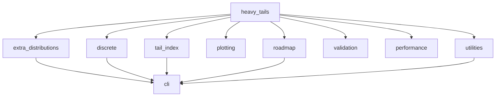

# Architecture

This page describes how `heavytails` is organised and why. It is aimed at
contributors; users can work entirely from the [User Guide](../guide/distributions.md).

## The governing constraint

**The library imports nothing outside the Python standard library.**

That single rule explains most of the design. It means the special functions are
written from scratch, the plotting helpers return coordinates rather than
figures, and anything needing NumPy, SciPy or Matplotlib is either optional and
guarded, or lives outside the package.

The benefits are real: `heavytails` installs anywhere Python does, has no
transitive vulnerability surface, and can be read end to end by a student
checking the mathematics. The cost is that performance work has to be done in
Python, which is why [benchmarking](benchmarks.md) is taken seriously.

## Module map

```
heavytails/
├── heavy_tails.py         Core continuous families, RNG, shared base machinery
├── extra_distributions.py Additional continuous families, numeric PPF solver
├── discrete.py            Discrete families
├── tail_index.py          Hill, Pickands and moment estimators
├── plotting.py            Diagnostic coordinates (no plotting dependency)
├── utilities.py           Data I/O, automatic fitting, model comparison
├── validation.py          Mathematical and numerical validation
├── performance.py         Caching, vectorised helpers, parallel sampling
├── extensions.py          Advanced features built on the core
├── roadmap.py             Fitting routines and planned work
├── cli.py                 Command-line interface
└── __main__.py            `python -m heavytails` entry point
```

### Dependency direction



`heavy_tails` is the foundation: it defines the RNG wrapper, the parameter-error
type and the sampling protocol that every other family builds on. Nothing in the
core imports upward from the higher layers, so the dependency graph stays
acyclic.

Imports inside the package are **absolute** (`from heavytails.heavy_tails import RNG`),
which Ruff enforces.

## Layers

### 1. Core distributions

Each family is a frozen dataclass carrying its parameters, validated once at
construction. Immutability means an instance can be shared and cached safely, and
validation at construction means every later method can assume its parameters are
sound rather than re-checking them.

Every family implements the same interface:

| Method     | Meaning                                    |
| ---------- | ------------------------------------------ |
| `pdf`/`pmf`| Density or mass function                   |
| `cdf`      | Distribution function                      |
| `sf`       | Survival function, $1 - F$                 |
| `ppf`      | Quantile function, $F^{-1}$                |
| `rvs`      | Random variates, optionally seeded         |

`sf` is a separate method rather than a helper computing `1 - cdf(x)` because in
the far tail that subtraction loses all its significant digits: once `cdf(x)`
rounds to `1.0`, the complement is exactly zero. Families with a closed-form
survival expression — `Pareto` among them — evaluate it directly and stay
accurate arbitrarily far out. Others currently delegate to `1 - cdf(x)`;
replacing one of those with a direct expression is a well-defined and welcome
contribution.

### 2. Special functions

The incomplete gamma and incomplete beta functions are implemented internally,
each switching between a series expansion and a continued fraction depending on
the argument. The switch point is chosen where both converge well, so accuracy
does not dip at the crossover. Their accuracy is checked against SciPy in
[Validation Studies](../theory/validation.md).

### The quantile function contract

Every family honours the same contract, so callers do not have to special-case
by family:

| Situation | Behaviour |
| --- | --- |
| `u` outside the open interval (0, 1) | raises `ValueError` |
| Quantile beyond the float range | returns `inf` |
| Solver cannot converge | raises `ConvergenceError` |

Returning `inf` rather than raising matters in practice: a parameter sweep that
crosses into the unrepresentable region should report `inf` for those points and
carry on, not abort at the first one. `LogNormal(mu=1000).ppf(0.5)` is `exp(1000)`,
which is genuinely not a float, and `inf` is the honest answer.

`ConvergenceError` exists so that a solver which ran out of iterations is
distinguishable from one that succeeded. Returning a best guess would leave the
caller unable to tell the two apart.

### 3. The numeric quantile solver

Families without a closed-form quantile use a safeguarded Newton iteration in
`_special`: Newton steps for speed, with a bisection fallback whenever a step
would leave the bracket. That guarantees convergence even where the density is
nearly flat, which unguarded Newton cannot.

The bracket is narrowed on every iteration from the sign of the residual,
including the iterations where a Newton step is accepted. Narrowing it only on
bisection fallbacks looks equivalent but is not: a run of accepted Newton steps
then consumes the whole iteration budget while the bracket stays as wide as it
started, so the method cannot tell whether it has converged.

### 4. Estimation and diagnostics

`tail_index` and `plotting` are deliberately thin and free of state. They take
sequences of floats and return numbers or coordinate lists. Keeping them
dependency-free and side-effect-free is what lets them be used from a notebook, a
script, or the CLI without adaptation.

### 5. Interfaces

`cli.py` is the only module that imports third-party packages (`typer` and
`rich`), and it does so behind a guard that produces an actionable message when
the `cli` extra is not installed. The library remains importable and fully
functional without them.

## Randomness and reproducibility

All sampling goes through one RNG wrapper rather than calling the `random` module
directly. Every `rvs` accepts a `seed`, and the same seed with the same
parameters always produces the same sequence. This is what makes the validation
studies and the benchmark suite reproducible, and it is why sampling code must
never reach for `random` directly.

## Error handling

Invalid parameters raise `ParameterError` at construction, with a message naming
the parameter and the constraint it violated. Failing at construction rather than
at first use means the traceback points at the line that made the mistake.

Numerical failure inside a solver raises rather than returning a sentinel:
silently returning `nan` propagates an invisible error through a whole analysis.

## Type annotations

The package is fully annotated and ships a `py.typed` marker, so downstream type
checkers see the annotations. `mypy` runs in strict mode over `heavytails/` and
`scripts/` in CI.

A few modules carry `ignore_errors` overrides in `pyproject.toml`. These are
acknowledged debt, not policy: they mark code written before strict checking was
introduced. Removing an override is a welcome contribution.

## Optional dependencies

Third-party imports appear only inside `try` blocks, and only in modules where
the functionality is genuinely optional:

| Module        | Optional import | Purpose                             |
| ------------- | --------------- | ----------------------------------- |
| `validation`  | `scipy`         | Cross-validation of the families    |
| `performance` | `numpy`         | Vectorised evaluation paths         |
| `extensions`  | `numpy`, `scipy`| Multivariate and copula features    |
| `roadmap`     | `scipy`         | Optimisation-based fitting          |
| `cli`         | `typer`, `rich` | The command-line interface          |

Each degrades gracefully: the feature reports itself unavailable instead of
raising an import error at package import time.

## Adding a distribution

1. Put continuous families in `extra_distributions.py`, discrete ones in
   `discrete.py`.
2. Implement it as a frozen dataclass validating its parameters in
   `__post_init__` and raising `ParameterError`.
3. Implement `pdf`/`pmf`, `cdf`, `sf`, `ppf` and `rvs`. Provide a closed-form
   `ppf` where one exists; otherwise use the shared numeric solver.
4. Compute `sf` from a closed-form expression where one exists, rather than as
   `1 - cdf`, so it stays accurate in the far tail.
5. Export it from `__init__.py` and add it to `__all__`.
6. Register it in the CLI's `DISTRIBUTIONS` mapping.
7. Add tests covering the properties in
   [Validation Studies](../theory/validation.md), plus known closed-form values.
8. Add it to the tables in the README and the
   [distributions guide](../guide/distributions.md).

See [Contributing](contributing.md) for the branch flow and review process.

## See also

- [Contributing](contributing.md) — workflow and conventions
- [Testing](testing.md) — the test suite
- [Benchmarking](benchmarks.md) — performance measurement
- [Code Review](code-review.md) — what reviewers look for
